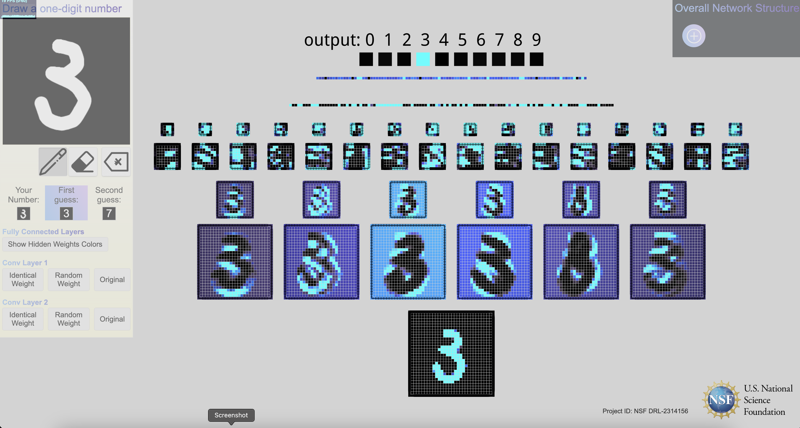
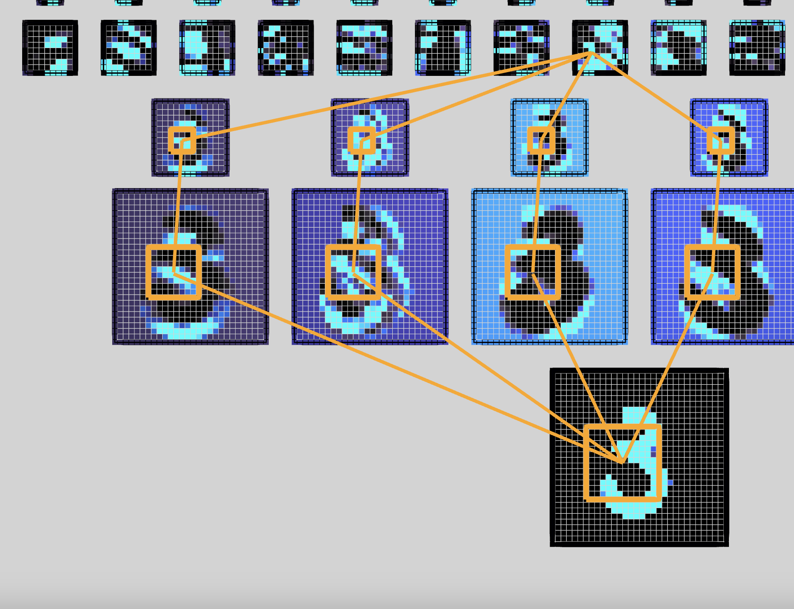
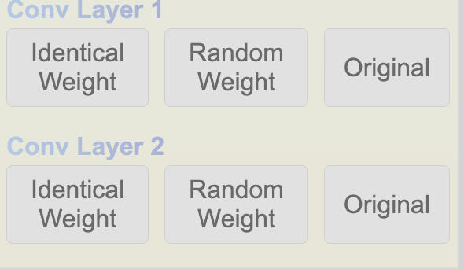
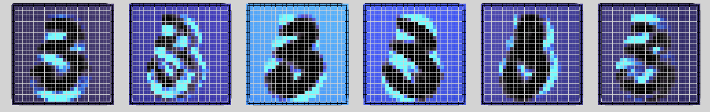
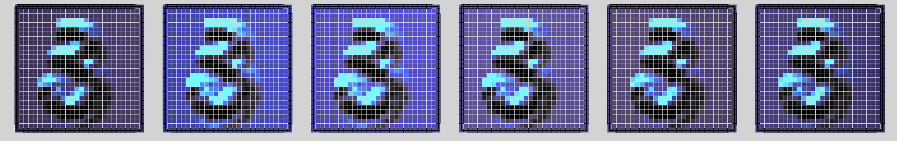
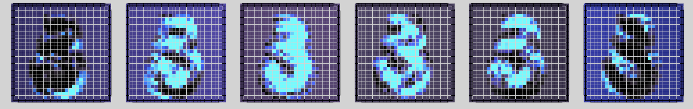
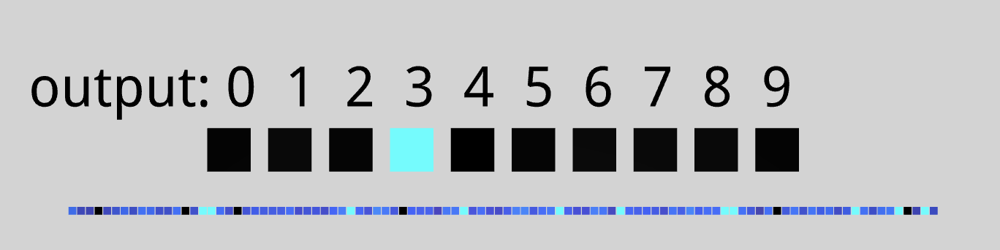
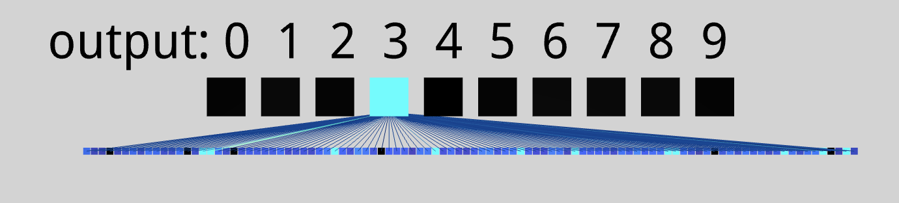
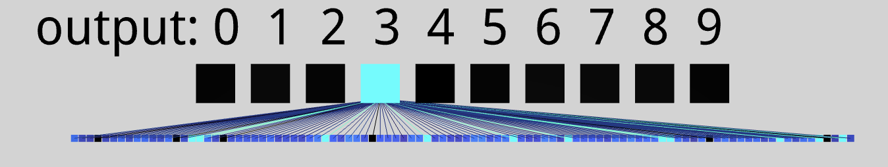
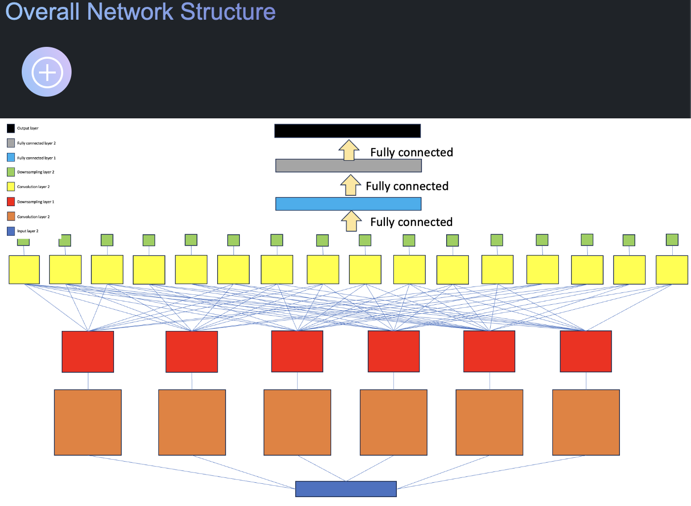

# An Interactive Node-Link Visualization of Convolutional Neural Networks

## Introduction
Project ID: `NSF DRL-2314156` This project showcases what each layer of neurons is highlighting in a convolutional neural network (CNN). The aim is to display the effects of deeper feature map layers on the output.

## Motivation
Sponsored by the National Science Foundation (NSF), this project is part of a 3-year initiative to bring AI education to underrepresented high schools in Tennessee. The project is done by Professor Pengyu Hong (Brandeis University) and his research group. We hope to use this visualization tool to spark interests in coding and linear algebra within those students. I work on the visualization of Convolutional Neural Network and will be used for teaching. 

## How to Use
Visit the [live demo](https://marcopo1o.github.io/visualize_neural_net/) and draw a digit on the canvas. The network will then show you the activation of each layer of neurons.

## Features and Updates
### 1. **Full Layer Connections:** 
Hovering over a node shows connections from that node back to the input layer, displaying the full path through the network, providing a clearer understanding of how features are propagated through the network.

### 2. **Randomize Weights:** 
Added buttons to randomize weights in the two convolution layers. This allows users to explore the effect of pre-trained weights on outputs. Users can also make all weights identical and revert changes. This is applied to both convolution layers. The following example is for the first convolution layer.

#### Original Weights

#### Identical Weights

#### Randomized Weights

### 3. **Enhanced Output Layer:** 
Enlarged and labeled the output layer for better visibility.

### 4. **Fully Connected Layers:** 
Edges can switch between displaying hidden weights and the output from the previous layer.

### 5. **Overall Network Structure:** 
Added an option to show an image of the entire CNN network structure used in this visualization.

## Acknowledgments
This project builds on code by Adam Harley. I would like to thank Professor Pengyu Hong from Brandeis University for his continuous mentorship and guidance, Zhengyang Zhou (PhD candidate at Brandeis University), and other members of Professor Hong's group for their help in testing the website. Special thanks to Kanh (Andrew) Nguyen for introducing me to this opportunity.

## Citation
A. W. Harley, "An Interactive Node-Link Visualization of Convolutional Neural Networks," in ISVC, pages 867-877, 2015

