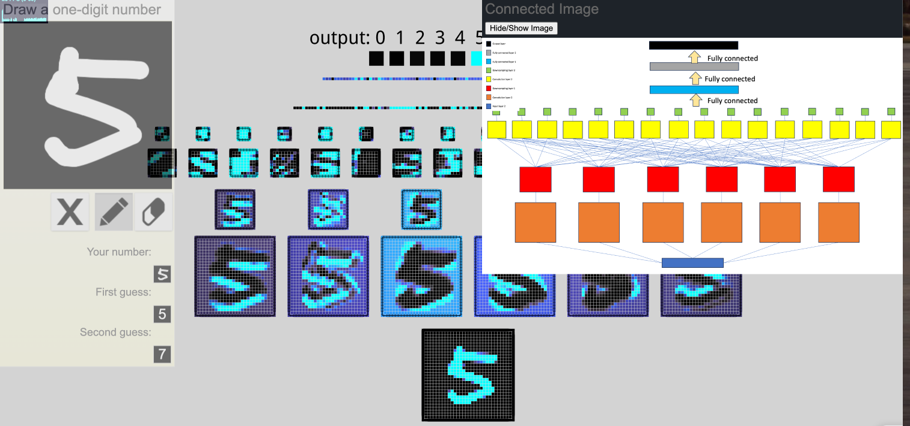

# An Interactive Node-Link Visualization of Convolutional Neural Networks (with all connection shown)

## Introduction
This is a project to showcase what each layer of neuron is highlighting. This project is aimed to display deeper feature map layers' effect on the output.

## Motivation
This project is sponsored by National Science Foundation (NSF) and the goal is to provide underprivileged high school students with AI education. Through understanding of how neural network works, students can spark their interest in Math and Computer Science. 

## How to use
Go to the [live demo](https://marcopo1o.github.io/visualize_neural_net/) and draw a digit on the canvas. The network will then show you the activation of each layer of neuron. 

1. 2d visualization of a convolutional network with all edges connected:

   

## Citation:
  
    `A. W. Harley, "An Interactive Node-Link Visualization of Convolutional Neural Networks," in ISVC, pages 867-877, 2015`
